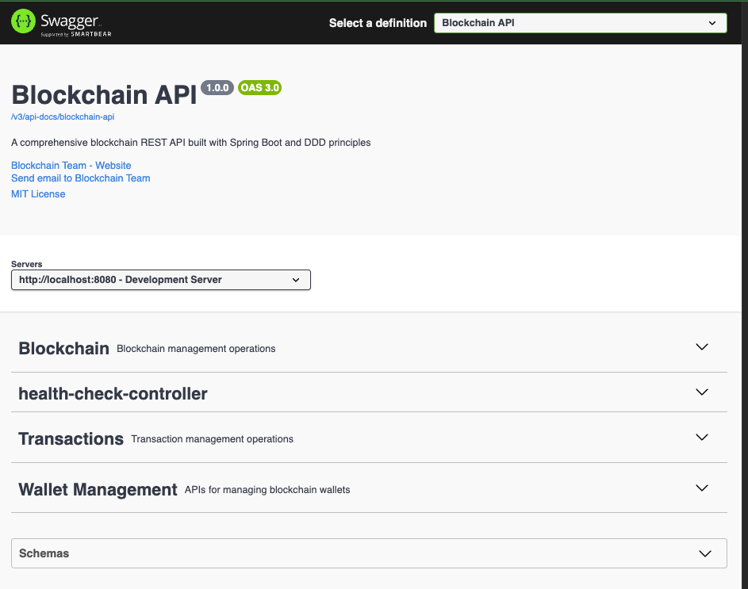
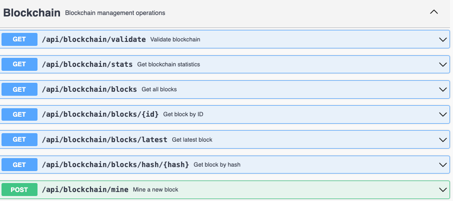
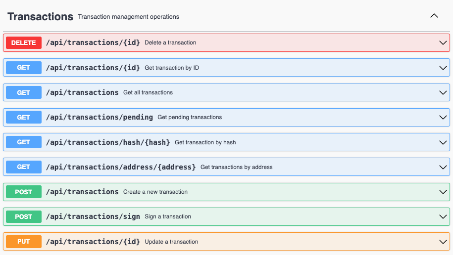
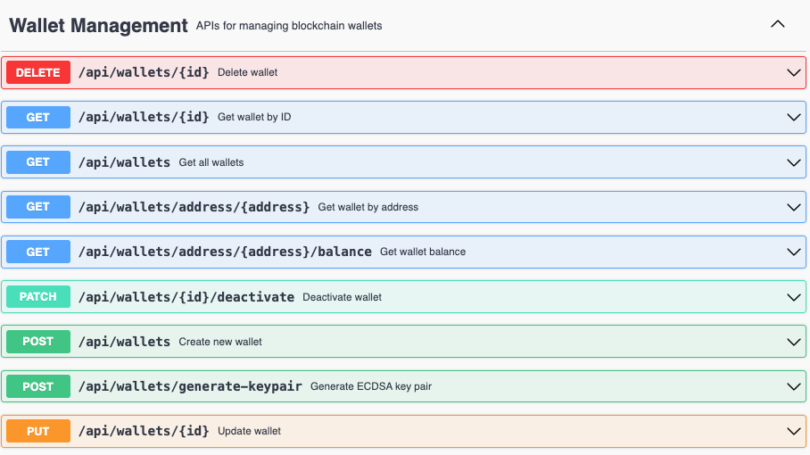
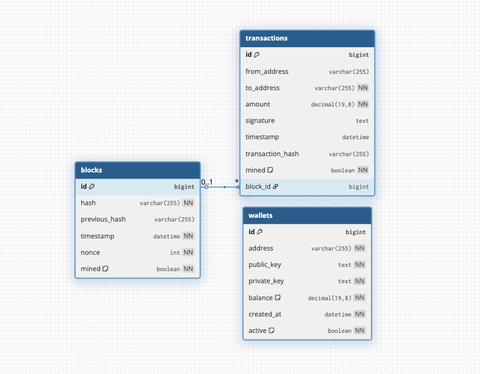

# Spring Boot Blockchain API

A comprehensive blockchain implementation built with Spring Boot, following Domain-Driven Design (DDD) principles and Clean Architecture patterns. This project demonstrates modern Java development practices with a focus on maintainability, testability, and scalability.

## 🏗️ Architecture Overview

This project implements a **Clean Architecture** with **Domain-Driven Design (DDD)** principles, organized into distinct layers:

```
┌─────────────────────────────────────────────────────────────┐
│                    Infrastructure Layer                     │
│  ┌─────────────────┐  ┌─────────────────┐  ┌─────────────┐ │
│  │   Web Layer     │  │  Persistence    │  │   External  │ │
│  │  (Controllers)  │  │   (Repositories)│  │  Services   │ │
│  └─────────────────┘  └─────────────────┘  └─────────────┘ │
└─────────────────────────────────────────────────────────────┘
┌─────────────────────────────────────────────────────────────┐
│                    Application Layer                        │
│  ┌─────────────────┐  ┌─────────────────┐  ┌─────────────┐ │
│  │   Services      │  │     DTOs        │  │   Mappers   │ │
│  │  (Use Cases)    │  │  (Request/Resp) │  │             │ │
│  └─────────────────┘  └─────────────────┘  └─────────────┘ │
└─────────────────────────────────────────────────────────────┘
┌─────────────────────────────────────────────────────────────┐
│                      Domain Layer                           │
│  ┌─────────────────┐  ┌─────────────────┐  ┌─────────────┐ │
│  │    Entities     │  │  Value Objects  │  │   Services  │ │
│  │  (Block, Wallet,│  │  (Hash, Address,│  │  (Business  │ │
│  │   Transaction)  │  │   Balance, etc) │  │   Logic)    │ │
│  └─────────────────┘  └─────────────────┘  └─────────────┘ │
└─────────────────────────────────────────────────────────────┘
```

## 🎯 Key Features

- **Blockchain Core**: Complete blockchain implementation with mining, validation, and transaction processing
- **Wallet Management**: Secure wallet creation, balance tracking, and transaction history
- **Transaction System**: P2P transactions with signature validation and balance verification
- **Mining Algorithm**: Proof-of-Work consensus mechanism with configurable difficulty
- **RESTful API**: Comprehensive REST API with OpenAPI/Swagger documentation
- **Database Integration**: MySQL persistence with JPA/Hibernate
- **Error Handling**: Centralized exception handling with custom error codes
- **Logging**: Comprehensive logging with SLF4J and Logback

## 🛠️ Technology Stack

### Core Technologies

- **Java 17** - Modern Java features and performance improvements
- **Spring Boot 3.5.6** - Rapid application development framework
- **Spring Data JPA** - Data persistence abstraction
- **Hibernate** - ORM framework
- **MySQL** - Primary database
- **Maven** - Dependency management and build tool

### Additional Libraries

- **Lombok** - Reduces boilerplate code
- **SpringDoc OpenAPI** - API documentation
- **Jakarta Validation** - Input validation
- **Jackson** - JSON serialization/deserialization

## 🏛️ Architectural Patterns

### 1. Clean Architecture

- **Dependency Inversion**: High-level modules don't depend on low-level modules
- **Separation of Concerns**: Each layer has distinct responsibilities
- **Testability**: Business logic is isolated and easily testable

### 2. Domain-Driven Design (DDD)

- **Entities**: `Block`, `Wallet`, `Transaction` with unique identity
- **Value Objects**: `Hash`, `Address`, `Balance`, `Amount`, `Signature`, `Nonce`, `Timestamp`
- **Domain Services**: Business logic that doesn't belong to entities
- **Aggregates**: Consistent boundaries for data modification

### 3. Repository Pattern

- **Ports**: Domain interfaces (`BlockRepositoryPort`, `WalletRepositoryPort`, `TransactionRepositoryPort`)
- **Adapters**: Infrastructure implementations (`BlockRepositoryAdapter`, etc.)
- **CQRS**: Separate read and write repositories (`ReadRepository`, `WriteRepository`)

### 4. Application Service Pattern

- **Use Cases**: Application services implement business use cases
- **Transaction Management**: `@Transactional` for data consistency
- **DTO Mapping**: Clean separation between domain and presentation layers

### 5. Result Pattern

- **Consistent API Responses**: Standardized success/error response format
- **Error Handling**: Centralized error management with custom error codes
- **Type Safety**: Enum-based error codes instead of string literals

### 6. Factory Pattern

- **Static Factory Methods**: For creating domain objects and exceptions
- **Builder Pattern**: For complex object construction
- **Value Object Creation**: Type-safe value object instantiation

### 7. Adapter Pattern

- **Infrastructure Adapters**: Bridge between domain and external systems
- **Repository Adapters**: JPA repository implementations
- **Mapper Adapters**: Domain-Entity conversion

## 🚧 Roadmap / Todo

1. **Full CQRS implementation** (separating command & query handlers)
2. **Unit tests** (especially for domain and application layers)
3. **Integration tests** (repository and controller layers)
4. **Event Sourcing / Domain Events** (event-driven approach for transaction and block lifecycle)
5. **Security enhancements** (JWT authentication, rate limiting, CORS configuration, etc.)
6. **Caching strategies** (e.g., blockchain validation, wallet balance queries)
7. **Message Queue integration** (Kafka / RabbitMQ for transaction publish & subscribe)
8. **Hash wallet keys at rest** (store public/private keys hashed with salt)

### Swagger Documentation



#### Blockchain



#### Transaction



#### Wallet



### Database Diagram



## 📁 Project Structure

```
src/main/java/com/ylcnfrht/blockchain/
├── application/                    # Application Layer
│   ├── dtos/                      # Data Transfer Objects
│   │   ├── request/               # Request DTOs
│   │   └── response/              # Response DTOs
│   ├── exceptions/                # Application Exceptions
│   ├── mappers/                   # DTO Mappers
│   ├── ports/                     # Application Ports (Interfaces)
│   └── services/                  # Application Services
│       ├── blockchain/
│       ├── transaction/
│       └── wallet/
├── domain/                        # Domain Layer
│   ├── blockchain/                # Blockchain Domain
│   │   ├── valueobjects/          # Blockchain Value Objects
│   │   └── Block.java             # Block Entity
│   ├── common/                    # Shared Domain Components
│   │   ├── repositories/          # Repository Interfaces
│   │   ├── services/              # Domain Services
│   │   └── valueobjects/          # Common Value Objects
│   ├── services/                  # Domain Services
│   ├── transaction/               # Transaction Domain
│   │   ├── valueobjects/          # Transaction Value Objects
│   │   └── Transaction.java       # Transaction Entity
│   └── wallet/                    # Wallet Domain
│       ├── valueobjects/          # Wallet Value Objects
│       └── Wallet.java            # Wallet Entity
├── infrastructure/                # Infrastructure Layer
│   ├── persistence/               # Data Persistence
│   │   ├── entities/              # JPA Entities
│   │   ├── jpa/                   # JPA Repositories
│   │   ├── mappers/               # Entity-Domain Mappers
│   │   └── repositories/          # Repository Adapters
│   └── web/                       # Web Layer
│       ├── result/                # Result Pattern Implementation
│       └── *Controller.java       # REST Controllers
```

## 🔧 Configuration

### Database Configuration

```yaml
spring:
  datasource:
    url: jdbc:mysql://localhost:3306/blockchain_db
    username: root
    password: root
  jpa:
    hibernate:
      ddl-auto: update
    show-sql: true
```

### Blockchain Configuration

```yaml
blockchain:
  mining:
    difficulty: 4 # Proof-of-Work difficulty
    reward: 100 # Mining reward amount
```

## 🚀 Getting Started

### Prerequisites

- Java 17 or higher
- Maven 3.6+
- MySQL 8.0+
- Git

### Installation

1. **Clone the repository**

   ```bash
   git clone <repository-url>
   cd springboot-blockchain
   ```

2. **Set up MySQL database**

   ```sql
   CREATE DATABASE blockchain_db;
   ```

3. **Update database configuration** (if needed)

   ```yaml
   # src/main/resources/application.yaml
   spring:
     datasource:
       url: jdbc:mysql://localhost:3306/blockchain_db
       username: your_username
       password: your_password
   ```

4. **Run the application**

   ```bash
   ./mvnw spring-boot:run
   ```

5. **Access the application**
   - API Base URL: `http://localhost:8080/api`
   - Swagger UI: `http://localhost:8080/swagger-ui/index.html`
   - Health Check: `http://localhost:8080/api/health`

## 📚 API Documentation

### Core Endpoints

#### Blockchain Operations

- `GET /api/blockchain/blocks` - Get all blocks
- `GET /api/blockchain/blocks/{id}` - Get block by ID
- `GET /api/blockchain/blocks/hash/{hash}` - Get block by hash
- `GET /api/blockchain/blocks/latest` - Get latest block
- `POST /api/blockchain/mine` - Mine pending transactions
- `GET /api/blockchain/validate` - Validate blockchain
- `GET /api/blockchain/stats` - Get blockchain statistics

#### Wallet Operations

- `GET /api/wallets` - Get all wallets
- `GET /api/wallets/{id}` - Get wallet by ID
- `GET /api/wallets/address/{address}` - Get wallet by address
- `GET /api/wallets/address/{address}/balance` - Get wallet balance
- `POST /api/wallets` - Create new wallet
- `POST /api/wallets/generate-keypair` - Generate a new ECDSA key pair (Base64)
- `PUT /api/wallets/{id}` - Update wallet
- `DELETE /api/wallets/{id}` - Delete wallet
- `PATCH /api/wallets/{id}/deactivate` - Deactivate wallet

#### Transaction Operations

- `GET /api/transactions` - Get all transactions
- `GET /api/transactions/{id}` - Get transaction by ID
- `GET /api/transactions/hash/{hash}` - Get transaction by hash
- `GET /api/transactions/address/{address}` - Get transactions by address
- `GET /api/transactions/pending` - Get pending transactions
- `POST /api/transactions` - Create new transaction
- `POST /api/transactions/sign` - Sign a pending transaction with a private key
- `PUT /api/transactions/{id}` - Update transaction
- `DELETE /api/transactions/{id}` - Delete transaction

### Typical Scenarios

- New user funding and first transfer

  1. Generate a key pair → create a wallet (e.g., address=alice)
  2. Mine with minerAddress=alice to receive the reward
  3. GET balance(alice) → confirmed > 0
  4. POST transaction (from=alice, to=bob, amount=10)
  5. (Optional) POST transactions/sign to sign the transaction
  6. Mine with minerAddress=alice → the transaction is confirmed and balances are updated

- Collecting rewards only
  - Repeatedly mine with your wallet as minerAddress to accumulate coinbase rewards (no transfers required)

### Response Format

All API responses follow the **Result Pattern**:

**Success Response:**

```json
{
  "success": true,
  "data": { ... },
  "message": "Operation successful",
  "timestamp": "2025-09-30T04:16:53.901031"
}
```

**Error Response:**

```json
{
  "success": false,
  "message": "Error description",
  "errorCode": "ERROR_CODE",
  "timestamp": "2025-09-30T04:16:58.005332"
}
```

## 🧪 Testing

### Running Tests

```bash
# Run all tests
./mvnw test

# Run specific test class
./mvnw test -Dtest=BlockchainApplicationServiceImplTest

# Run with coverage
./mvnw test jacoco:report
```

### Test Structure

- **Unit Tests**: Domain logic and application services
- **Integration Tests**: Repository and controller layers
- **Contract Tests**: API endpoint validation

## 🔒 Security Features

- **Input Validation**: Jakarta Validation annotations
- **SQL Injection Prevention**: JPA/Hibernate parameterized queries
- **Error Information Disclosure**: Sanitized error messages
- **Transaction Security**: Atomic operations with `@Transactional`

## 📊 Monitoring & Logging

### Logging Configuration

```yaml
logging:
  level:
    com.ylcnfrht.blockchain: DEBUG
    org.hibernate.SQL: DEBUG
```

## 🗄️ Database Schema (Text-Based)

The application uses MySQL with three main tables: `blocks`, `transactions`, and `wallets`.

### Tables

```sql
-- blocks: one row per mined block
CREATE TABLE blocks (
  id BIGINT PRIMARY KEY AUTO_INCREMENT,
  hash VARCHAR(255) NOT NULL UNIQUE,
  previous_hash VARCHAR(255),
  timestamp DATETIME NOT NULL,
  nonce INT NOT NULL,
  mined BOOLEAN NOT NULL DEFAULT TRUE
);

-- transactions: transfer and coinbase (reward) records
CREATE TABLE transactions (
  id BIGINT PRIMARY KEY AUTO_INCREMENT,
  from_address VARCHAR(255),          -- NULL for coinbase (reward) tx
  to_address VARCHAR(255) NOT NULL,
  amount DECIMAL(19,8) NOT NULL,
  signature TEXT,                     -- optional; present if signed
  timestamp DATETIME,                 -- creation time
  transaction_hash VARCHAR(255),      -- optional domain hash
  mined BOOLEAN NOT NULL DEFAULT FALSE,
  block_id BIGINT,                    -- FK to blocks.id (NULL if pending)
  CONSTRAINT fk_transactions_block
    FOREIGN KEY (block_id) REFERENCES blocks(id)
);

-- wallets: registered wallet records
CREATE TABLE wallets (
  id BIGINT PRIMARY KEY AUTO_INCREMENT,
  address VARCHAR(255) NOT NULL UNIQUE,  -- human-readable address
  public_key TEXT NOT NULL,              -- TODO: store hashed (see Roadmap)
  private_key TEXT NOT NULL,             -- TODO: store hashed (see Roadmap)
  balance DECIMAL(19,8) NOT NULL DEFAULT 0,
  created_at DATETIME NOT NULL,
  active BOOLEAN NOT NULL DEFAULT TRUE
);
```

### Relationships

- `blocks (1) —— (n) transactions`: `transactions.block_id` references `blocks.id`.
- `wallets` are not hard-FK’d to transactions by design; `transactions.from_address`/`to_address` store address strings to allow external addresses and simpler pending handling.

### Notes

- Pending transactions have `block_id = NULL` and `mined = FALSE`.
- When a block is mined, included transactions are persisted with `mined = TRUE` and `block_id = <new block id>`.
- Coinbase (reward) transactions have `from_address = NULL` and are always appended last in a block.
- Balances are computed from the ledger; `wallets.balance` is kept in sync after mining for quick reads.

### Health Checks

- `GET /api/health` - Application health status
- Database connectivity monitoring
- Service availability checks

## 🚀 Deployment

### Docker Deployment

```dockerfile
FROM openjdk:17-jdk-slim
COPY target/blockchain-0.0.1-SNAPSHOT.jar app.jar
EXPOSE 8080
ENTRYPOINT ["java", "-jar", "/app.jar"]
```

## 🤝 Contributing

1. Fork the repository
2. Create a feature branch (`git checkout -b feature/amazing-feature`)
3. Commit your changes (`git commit -m 'Add amazing feature'`)
4. Push to the branch (`git push origin feature/amazing-feature`)
5. Open a Pull Request

## 📝 License

This project is licensed under the MIT License - see the [LICENSE](LICENSE) file for details.

## 🙏 Acknowledgments

- Spring Boot team for the excellent framework
- Domain-Driven Design community for architectural guidance
- Clean Architecture principles by Robert C. Martin
- Blockchain technology pioneers

## 📞 Support

For support and questions:

- Create an issue in the repository
- Contact: blockchain@demo.com
- Documentation: [API Docs](http://localhost:8080/swagger-ui/index.html)

---

**Built with ❤️ using Spring Boot, DDD, and Clean Architecture principles**

## 👤 Author

- ylcnfrht
